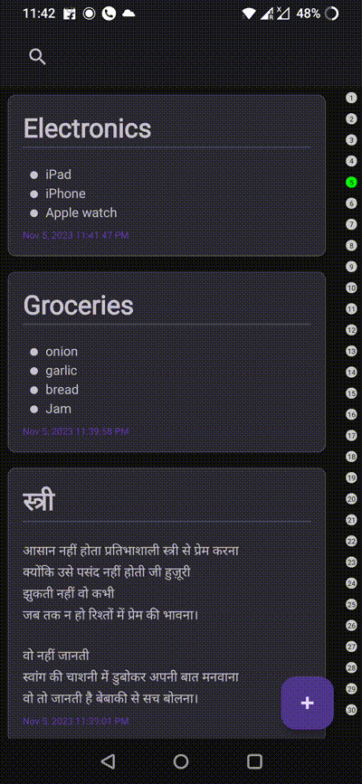

# iNKLY: Your Daily Reflection Companion

iNKLY is an intuitive Android application designed to capture your daily reflections in a structured and organized manner.

## Features
### Implemented:
- **Note Creation**: Create new notes with text input in `CreateNoteActivity`.
- **Note Viewing**: View notes in a list on the main screen using a `RecyclerView`.
- **Note Deletion**: Swipe right to delete notes.
- **Viewing Progress**: Graphical representation of note creation progress over time with `ContributionsGraphView`.
- **Modern UI**: Sleek design with modern layout designs and a floating action button for new note creation.
- **Note Editing**: Swipe left to edit notes in `CreateNoteActivity`.
- **Markdown Formatting**: Buttons for basic markdown formatting like bold, italic, etc.
- **Search Functionality**: Search for notes based on content.

## Architecture & Technology
- **Language**: Kotlin
- **Architecture**: MVVM (Model-View-ViewModel)
- **Database**: Room
- **Libraries**: AndroidX, LiveData

## License
Open sourced under the MIT license.

## Getting Started
Clone the repository, delve into the code, and explore the modern Android architecture encapsulating iNKLY's functionality.

## Contributing
We welcome contributions of any kind including feature suggestions, bug fixing, or any other improvements! Feel free to submit a pull request or create an issue to discuss any changes or report bugs. Your feedback and contributions are highly appreciated.
